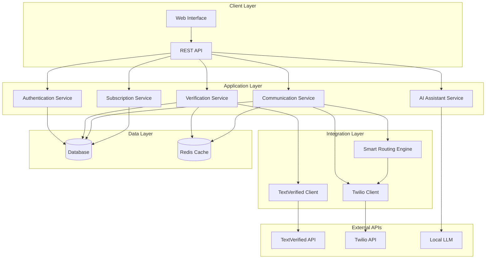

# Design Document

## Overview

The enhanced communication platform integrates both Twilio and TextVerified APIs to provide comprehensive SMS services. The system offers service verification through temporary numbers, dedicated number provisioning with smart international routing, and AI-powered conversational capabilities.

## Architecture

### High-Level Architecture



### Service Architecture

1. **Verification Service**: Handles TextVerified temporary numbers for service verification
2. **Communication Service**: Manages Twilio numbers for direct SMS communication
3. **Smart Routing Engine**: Optimizes number selection based on destination country
4. **AI Assistant Service**: Provides conversational AI capabilities
5. **Subscription Service**: Manages number purchases and subscriptions

## Components and Interfaces

### Core Components

#### 1. TextVerified Client (`textverified_client.py`)
```python
class TextVerifiedClient:
    def __init__(self, api_key: str, email: str)
    async def create_verification(self, service_name: str) -> str
    async def get_verification_number(self, verification_id: str) -> str
    async def get_sms_messages(self, verification_id: str) -> List[str]
    async def cancel_verification(self, verification_id: str) -> bool
    async def check_balance(self) -> float
```

#### 2. Enhanced Twilio Client (`twilio_client.py`)
```python
class EnhancedTwilioClient:
    def __init__(self, account_sid: str, auth_token: str)
    async def send_sms(self, from_number: str, to_number: str, message: str) -> str
    async def receive_sms_webhook(self, webhook_data: dict) -> dict
    async def purchase_number(self, country_code: str, area_code: str = None) -> str
    async def list_available_numbers(self, country_code: str) -> List[dict]
    async def release_number(self, phone_number: str) -> bool
```

#### 3. Smart Routing Engine (`routing_engine.py`)
```python
class SmartRoutingEngine:
    def __init__(self, twilio_client: EnhancedTwilioClient)
    async def suggest_optimal_number(self, destination: str, user_numbers: List[str]) -> dict
    async def calculate_costs(self, from_country: str, to_country: str) -> dict
    async def get_country_from_number(self, phone_number: str) -> str
    def get_closest_country_codes(self, target_country: str) -> List[str]
```

#### 4. Communication Service (`communication_service.py`)
```python
class CommunicationService:
    def __init__(self, twilio_client: EnhancedTwilioClient, routing_engine: SmartRoutingEngine)
    async def send_message(self, user_id: str, to_number: str, message: str, options: dict) -> dict
    async def receive_message(self, webhook_data: dict) -> dict
    async def get_conversation_history(self, user_id: str, number: str) -> List[dict]
    async def manage_user_numbers(self, user_id: str) -> List[dict]
```

#### 5. AI Assistant Service (`ai_service.py`)
```python
class AIAssistantService:
    def __init__(self, model_path: str)
    async def suggest_response(self, conversation_context: List[dict]) -> str
    async def analyze_message_intent(self, message: str) -> dict
    async def generate_contextual_help(self, user_query: str) -> str
    def process_locally(self, prompt: str) -> str
```

### API Endpoints

#### Verification Endpoints
- `POST /api/verification/create` - Create service verification
- `GET /api/verification/{id}/number` - Get verification number
- `GET /api/verification/{id}/messages` - Get received SMS
- `DELETE /api/verification/{id}` - Cancel verification

#### Communication Endpoints
- `POST /api/sms/send` - Send SMS with routing options
- `POST /api/sms/receive` - Webhook for incoming SMS
- `GET /api/sms/conversations/{user_id}` - Get conversation history
- `GET /api/sms/suggestions` - Get AI response suggestions

#### Number Management Endpoints
- `GET /api/numbers/available/{country_code}` - List available numbers
- `POST /api/numbers/purchase` - Purchase dedicated number
- `GET /api/numbers/user/{user_id}` - Get user's numbers
- `DELETE /api/numbers/{number_id}` - Release number

#### Subscription Endpoints
- `GET /api/subscriptions/plans` - List subscription plans
- `POST /api/subscriptions/subscribe` - Create subscription
- `GET /api/subscriptions/user/{user_id}` - Get user subscriptions
- `PUT /api/subscriptions/{id}/renew` - Renew subscription

## Data Models

### User Model
```python
class User(BaseModel):
    id: str
    email: str
    name: str
    created_at: datetime
    subscription_tier: str
    balance: float
    primary_number: Optional[str]
```

### Verification Model
```python
class Verification(BaseModel):
    id: str
    user_id: str
    service_name: str
    temp_number: str
    status: str  # pending, completed, expired, cancelled
    created_at: datetime
    expires_at: datetime
    messages: List[str]
```

### UserNumber Model
```python
class UserNumber(BaseModel):
    id: str
    user_id: str
    phone_number: str
    country_code: str
    number_type: str  # primary, purchased, subscription
    status: str  # active, inactive, expired
    purchased_at: datetime
    expires_at: Optional[datetime]
    monthly_cost: float
```

### Message Model
```python
class Message(BaseModel):
    id: str
    user_id: str
    from_number: str
    to_number: str
    content: str
    direction: str  # inbound, outbound
    timestamp: datetime
    cost: float
    status: str  # sent, delivered, failed
    ai_suggested: bool
```

### Subscription Model
```python
class Subscription(BaseModel):
    id: str
    user_id: str
    plan_type: str  # basic, premium, enterprise
    status: str  # active, cancelled, expired
    start_date: datetime
    end_date: datetime
    monthly_cost: float
    included_numbers: int
    included_messages: int
```

## Error Handling

### API Error Responses
```python
class APIError(BaseModel):
    error_code: str
    message: str
    details: Optional[dict]
    timestamp: datetime

# Error Categories
TEXTVERIFIED_ERRORS = {
    "AUTH_FAILED": "TextVerified authentication failed",
    "INSUFFICIENT_BALANCE": "Insufficient TextVerified balance",
    "SERVICE_UNAVAILABLE": "Requested service not available"
}

TWILIO_ERRORS = {
    "INVALID_NUMBER": "Invalid phone number format",
    "RATE_LIMIT": "Twilio rate limit exceeded",
    "INSUFFICIENT_FUNDS": "Insufficient Twilio account balance"
}
```

### Retry Logic
- Exponential backoff for API failures
- Circuit breaker pattern for external services
- Fallback mechanisms between services

## Testing Strategy

### Unit Tests
- Test each service component independently
- Mock external API calls
- Validate data models and business logic

### Integration Tests
- Test API endpoints end-to-end
- Validate webhook handling
- Test service interactions

### Load Tests
- Test concurrent verification requests
- Validate message throughput
- Test subscription management under load

### Security Tests
- Validate authentication and authorization
- Test input sanitization
- Verify webhook signature validation

## Performance Considerations

### Caching Strategy
- Cache TextVerified bearer tokens
- Cache country code mappings
- Cache user number preferences
- Cache AI model responses for common queries

### Database Optimization
- Index frequently queried fields (user_id, phone_number, timestamp)
- Partition message tables by date
- Use read replicas for analytics queries

### Rate Limiting
- Implement per-user rate limits
- Queue non-urgent requests
- Prioritize real-time communication over verification requests

## Security Measures

### Authentication
- JWT tokens for API access
- API key rotation for external services
- Webhook signature verification

### Data Protection
- Encrypt sensitive data at rest
- Use HTTPS for all communications
- Implement data retention policies
- Local AI processing to maintain privacy

### Access Control
- Role-based access control
- User data isolation
- Audit logging for all operations