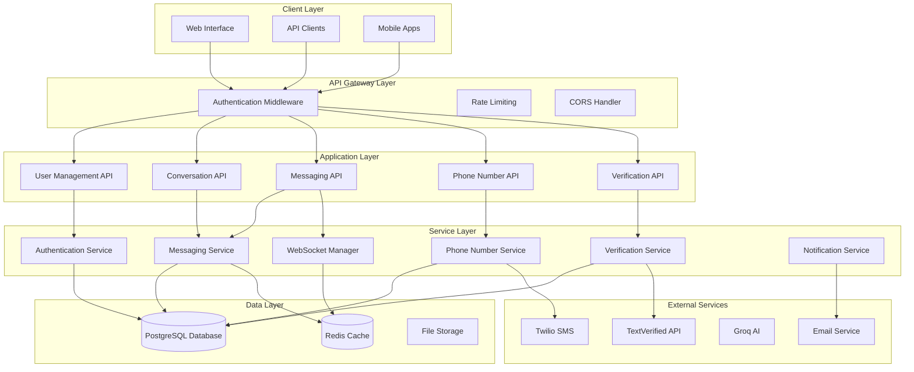
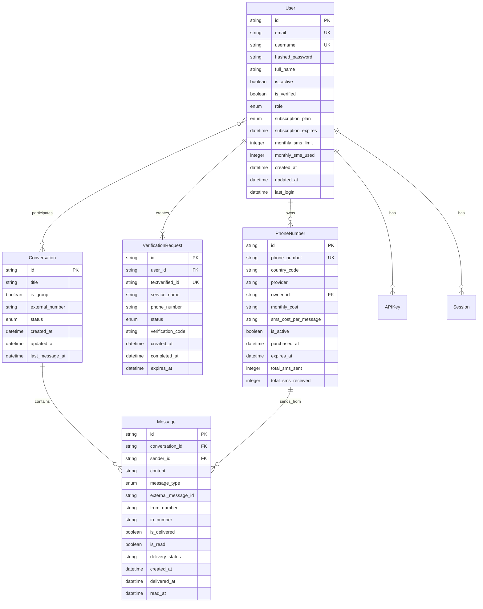

# Design Document

## Overview

This design document outlines the architecture and implementation approach for CumApp v1.1, which transforms the platform from a demo-ready application into a production-ready multi-user communication platform. The design focuses on implementing robust user authentication, persistent data storage, enhanced real-time communication, comprehensive phone number management, and advanced verification tracking.

The v1.1 upgrade builds upon the existing FastAPI architecture while adding essential production features including JWT-based authentication, PostgreSQL database integration, enhanced WebSocket communication, and comprehensive user management capabilities.

## Architecture

### System Architecture Overview



### Database Architecture

The system uses PostgreSQL as the primary database with the following key entities:



## Components and Interfaces

### Authentication System

#### JWT Token Management
- **Access Tokens**: Short-lived (15 minutes) for API access
- **Refresh Tokens**: Long-lived (7 days) for token renewal
- **API Keys**: Long-lived tokens for programmatic access

#### Authentication Flow
```python
class AuthenticationService:
    async def register_user(email: str, username: str, password: str) -> UserResponse
    async def authenticate_user(email: str, password: str) -> TokenResponse
    async def refresh_token(refresh_token: str) -> TokenResponse
    async def verify_email(token: str) -> bool
    async def reset_password(email: str) -> bool
    async def change_password(user_id: str, old_password: str, new_password: str) -> bool
```

#### Authorization Middleware
```python
class AuthorizationMiddleware:
    async def verify_jwt_token(token: str) -> User
    async def verify_api_key(api_key: str) -> User
    async def check_permissions(user: User, resource: str, action: str) -> bool
    async def rate_limit_check(user: User, endpoint: str) -> bool
```

### User Management System

#### User Profile Management
```python
class UserService:
    async def get_user_profile(user_id: str) -> UserProfile
    async def update_user_profile(user_id: str, updates: UserUpdate) -> UserProfile
    async def get_user_statistics(user_id: str) -> UserStatistics
    async def manage_api_keys(user_id: str) -> List[APIKey]
    async def update_subscription(user_id: str, plan: SubscriptionPlan) -> Subscription
```

#### Dashboard Analytics
```python
class DashboardService:
    async def get_usage_summary(user_id: str, period: str) -> UsageSummary
    async def get_recent_activity(user_id: str, limit: int) -> List[Activity]
    async def get_cost_breakdown(user_id: str, period: str) -> CostBreakdown
    async def get_verification_history(user_id: str) -> List[VerificationSummary]
```

### Enhanced Messaging System

#### Persistent Message Storage
```python
class MessageService:
    async def send_message(sender_id: str, conversation_id: str, content: str, message_type: MessageType) -> Message
    async def get_conversation_messages(conversation_id: str, user_id: str, limit: int, offset: int) -> List[Message]
    async def search_messages(user_id: str, query: str, filters: MessageFilters) -> List[Message]
    async def mark_messages_read(user_id: str, conversation_id: str, message_ids: List[str]) -> bool
    async def delete_message(user_id: str, message_id: str) -> bool
```

#### Real-time Communication Enhancement
```python
class EnhancedWebSocketManager:
    async def handle_connection(websocket: WebSocket, user_id: str) -> None
    async def send_typing_indicator(user_id: str, conversation_id: str, is_typing: bool) -> None
    async def broadcast_message(conversation_id: str, message: Message, exclude_user: str) -> None
    async def send_notification(user_id: str, notification: Notification) -> None
    async def handle_presence_update(user_id: str, status: PresenceStatus) -> None
```

### Phone Number Management System

#### Number Marketplace
```python
class PhoneNumberService:
    async def get_available_numbers(country_code: str, area_code: str = None) -> List[AvailableNumber]
    async def purchase_number(user_id: str, phone_number: str, provider: str) -> PurchaseResult
    async def get_owned_numbers(user_id: str) -> List[OwnedNumber]
    async def renew_number_subscription(user_id: str, number_id: str) -> RenewalResult
    async def cancel_number_subscription(user_id: str, number_id: str) -> CancellationResult
    async def get_number_usage_statistics(user_id: str, number_id: str) -> NumberUsageStats
```

#### Provider Integration
```python
class NumberProviderInterface:
    async def search_available_numbers(country: str, area_code: str) -> List[ProviderNumber]
    async def purchase_number(phone_number: str) -> PurchaseResponse
    async def release_number(phone_number: str) -> ReleaseResponse
    async def get_number_capabilities(phone_number: str) -> NumberCapabilities
```

### Advanced Verification Management

#### Verification Tracking
```python
class VerificationService:
    async def create_verification(user_id: str, service_name: str, capability: str) -> VerificationRequest
    async def get_verification_number(user_id: str, verification_id: str) -> str
    async def check_verification_messages(user_id: str, verification_id: str) -> List[str]
    async def get_verification_history(user_id: str, filters: VerificationFilters) -> List[VerificationRequest]
    async def cancel_verification(user_id: str, verification_id: str) -> bool
    async def export_verification_data(user_id: str, format: str) -> ExportResult
```

#### Automated Code Extraction
```python
class CodeExtractionService:
    def extract_verification_codes(message_content: str) -> List[str]
    def identify_service_patterns(message_content: str, service_name: str) -> CodeMatch
    def validate_code_format(code: str, service_name: str) -> bool
```

## Data Models

### Core User Models

```python
class User(Base):
    __tablename__ = "users"
    
    id: str = Column(String, primary_key=True, default=lambda: str(uuid.uuid4()))
    email: str = Column(String, unique=True, index=True, nullable=False)
    username: str = Column(String, unique=True, index=True, nullable=False)
    hashed_password: str = Column(String, nullable=False)
    full_name: Optional[str] = Column(String)
    
    # Account status
    is_active: bool = Column(Boolean, default=True)
    is_verified: bool = Column(Boolean, default=False)
    role: UserRole = Column(Enum(UserRole), default=UserRole.USER)
    
    # Subscription
    subscription_plan: SubscriptionPlan = Column(Enum(SubscriptionPlan), default=SubscriptionPlan.FREE)
    subscription_expires: Optional[datetime] = Column(DateTime)
    
    # Usage limits
    monthly_sms_limit: int = Column(Integer, default=100)
    monthly_sms_used: int = Column(Integer, default=0)
    monthly_voice_minutes_limit: int = Column(Integer, default=60)
    monthly_voice_minutes_used: int = Column(Integer, default=0)
    
    # Timestamps
    created_at: datetime = Column(DateTime, default=datetime.utcnow)
    updated_at: datetime = Column(DateTime, default=datetime.utcnow, onupdate=datetime.utcnow)
    last_login: Optional[datetime] = Column(DateTime)
    
    # API access
    api_calls_today: int = Column(Integer, default=0)
    api_rate_limit: int = Column(Integer, default=1000)

class Session(Base):
    __tablename__ = "sessions"
    
    id: str = Column(String, primary_key=True)
    user_id: str = Column(String, ForeignKey("users.id"), nullable=False)
    refresh_token: str = Column(String, unique=True, nullable=False)
    expires_at: datetime = Column(DateTime, nullable=False)
    created_at: datetime = Column(DateTime, default=datetime.utcnow)
    last_used: datetime = Column(DateTime, default=datetime.utcnow)
    user_agent: Optional[str] = Column(String)
    ip_address: Optional[str] = Column(String)

class APIKey(Base):
    __tablename__ = "api_keys"
    
    id: str = Column(String, primary_key=True)
    user_id: str = Column(String, ForeignKey("users.id"), nullable=False)
    key_hash: str = Column(String, unique=True, nullable=False)
    name: str = Column(String, nullable=False)
    scopes: str = Column(String)  # JSON array of permissions
    is_active: bool = Column(Boolean, default=True)
    last_used: Optional[datetime] = Column(DateTime)
    expires_at: Optional[datetime] = Column(DateTime)
    created_at: datetime = Column(DateTime, default=datetime.utcnow)
```

### Enhanced Conversation Models

```python
class Conversation(Base):
    __tablename__ = "conversations"
    
    id: str = Column(String, primary_key=True, default=lambda: str(uuid.uuid4()))
    title: Optional[str] = Column(String)
    is_group: bool = Column(Boolean, default=False)
    external_number: Optional[str] = Column(String)
    status: ConversationStatus = Column(Enum(ConversationStatus), default=ConversationStatus.ACTIVE)
    
    # Metadata
    created_by: str = Column(String, ForeignKey("users.id"))
    created_at: datetime = Column(DateTime, default=datetime.utcnow)
    updated_at: datetime = Column(DateTime, default=datetime.utcnow, onupdate=datetime.utcnow)
    last_message_at: Optional[datetime] = Column(DateTime)
    
    # Settings
    is_archived: bool = Column(Boolean, default=False)
    is_muted: bool = Column(Boolean, default=False)
    
    # Relationships
    participants = relationship("User", secondary="conversation_participants", back_populates="conversations")
    messages = relationship("Message", back_populates="conversation", order_by="Message.created_at")

class Message(Base):
    __tablename__ = "messages"
    
    id: str = Column(String, primary_key=True, default=lambda: str(uuid.uuid4()))
    conversation_id: str = Column(String, ForeignKey("conversations.id"), nullable=False)
    sender_id: Optional[str] = Column(String, ForeignKey("users.id"))
    
    # Content
    content: str = Column(Text, nullable=False)
    message_type: MessageType = Column(Enum(MessageType), default=MessageType.CHAT)
    
    # External message details
    external_message_id: Optional[str] = Column(String)
    from_number: Optional[str] = Column(String)
    to_number: Optional[str] = Column(String)
    
    # Status tracking
    is_delivered: bool = Column(Boolean, default=False)
    is_read: bool = Column(Boolean, default=False)
    delivery_status: Optional[str] = Column(String)
    
    # Metadata
    is_edited: bool = Column(Boolean, default=False)
    is_deleted: bool = Column(Boolean, default=False)
    
    # Timestamps
    created_at: datetime = Column(DateTime, default=datetime.utcnow)
    updated_at: datetime = Column(DateTime, default=datetime.utcnow, onupdate=datetime.utcnow)
    delivered_at: Optional[datetime] = Column(DateTime)
    read_at: Optional[datetime] = Column(DateTime)
    
    # Relationships
    conversation = relationship("Conversation", back_populates="messages")
    sender = relationship("User", foreign_keys=[sender_id])
```

## Error Handling

### Centralized Error Management

```python
class CumAppException(Exception):
    """Base exception for CumApp platform"""
    def __init__(self, message: str, error_code: str = None, details: dict = None):
        self.message = message
        self.error_code = error_code
        self.details = details or {}
        super().__init__(self.message)

class AuthenticationError(CumAppException):
    """Authentication related errors"""
    pass

class AuthorizationError(CumAppException):
    """Authorization related errors"""
    pass

class ValidationError(CumAppException):
    """Data validation errors"""
    pass

class ResourceNotFoundError(CumAppException):
    """Resource not found errors"""
    pass

class RateLimitError(CumAppException):
    """Rate limiting errors"""
    pass

class ExternalServiceError(CumAppException):
    """External service integration errors"""
    pass
```

### Error Response Format

```python
class ErrorResponse(BaseModel):
    error: str
    error_code: str
    message: str
    details: Optional[Dict[str, Any]] = None
    timestamp: datetime
    request_id: str

@app.exception_handler(CumAppException)
async def smsproj_exception_handler(request: Request, exc: CumAppException):
    return JSONResponse(
        status_code=400,
        content=ErrorResponse(
            error=exc.__class__.__name__,
            error_code=exc.error_code or "UNKNOWN_ERROR",
            message=exc.message,
            details=exc.details,
            timestamp=datetime.utcnow(),
            request_id=str(uuid.uuid4())
        ).dict()
    )
```

## Testing Strategy

### Unit Testing Approach

```python
# Authentication Service Tests
class TestAuthenticationService:
    async def test_user_registration_success(self)
    async def test_user_registration_duplicate_email(self)
    async def test_user_login_success(self)
    async def test_user_login_invalid_credentials(self)
    async def test_jwt_token_generation(self)
    async def test_jwt_token_validation(self)
    async def test_password_reset_flow(self)

# Messaging Service Tests
class TestMessagingService:
    async def test_send_internal_message(self)
    async def test_send_sms_to_external(self)
    async def test_conversation_creation(self)
    async def test_message_persistence(self)
    async def test_message_search(self)
    async def test_real_time_delivery(self)

# Phone Number Service Tests
class TestPhoneNumberService:
    async def test_number_search(self)
    async def test_number_purchase(self)
    async def test_number_renewal(self)
    async def test_usage_tracking(self)
    async def test_provider_integration(self)
```

### Integration Testing

```python
class TestAPIIntegration:
    async def test_user_registration_flow(self)
    async def test_conversation_creation_and_messaging(self)
    async def test_phone_number_purchase_and_usage(self)
    async def test_verification_request_lifecycle(self)
    async def test_websocket_real_time_communication(self)
    async def test_authentication_and_authorization(self)
```

### Performance Testing

```python
class TestPerformance:
    async def test_concurrent_user_connections(self)
    async def test_message_throughput(self)
    async def test_database_query_performance(self)
    async def test_websocket_scalability(self)
    async def test_api_response_times(self)
```

### Security Testing

```python
class TestSecurity:
    async def test_sql_injection_prevention(self)
    async def test_jwt_token_security(self)
    async def test_rate_limiting_enforcement(self)
    async def test_input_validation(self)
    async def test_authorization_bypass_attempts(self)
```

## Security Considerations

### Authentication Security
- **Password Hashing**: bcrypt with salt rounds ≥ 12
- **JWT Security**: RS256 algorithm with key rotation
- **Session Management**: Secure refresh token storage
- **Multi-factor Authentication**: TOTP support for premium users

### API Security
- **Rate Limiting**: Per-user and per-endpoint limits
- **Input Validation**: Comprehensive Pydantic validation
- **SQL Injection Prevention**: SQLAlchemy ORM usage
- **CORS Configuration**: Strict origin validation

### Data Protection
- **Encryption at Rest**: Database-level encryption
- **Encryption in Transit**: TLS 1.3 for all communications
- **PII Handling**: Minimal data collection and retention policies
- **Audit Logging**: Comprehensive activity tracking

### WebSocket Security
- **Connection Authentication**: JWT validation on connect
- **Message Validation**: Schema validation for all messages
- **Rate Limiting**: Per-connection message limits
- **Connection Monitoring**: Anomaly detection and blocking

## Performance Optimization

### Database Optimization
- **Indexing Strategy**: Optimized indexes for common queries
- **Connection Pooling**: Efficient database connection management
- **Query Optimization**: Lazy loading and query batching
- **Caching Layer**: Redis for frequently accessed data

### Real-time Performance
- **WebSocket Scaling**: Horizontal scaling with Redis pub/sub
- **Message Queuing**: Asynchronous message processing
- **Connection Management**: Efficient connection pooling
- **Presence Optimization**: Efficient online status tracking

### API Performance
- **Response Caching**: Strategic endpoint caching
- **Pagination**: Efficient large dataset handling
- **Compression**: Response compression for large payloads
- **CDN Integration**: Static asset delivery optimization

This design provides a comprehensive foundation for implementing the v1.1 features while maintaining scalability, security, and performance standards required for a production communication platform.